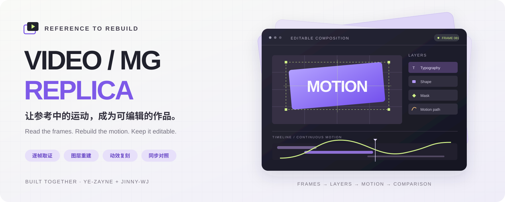
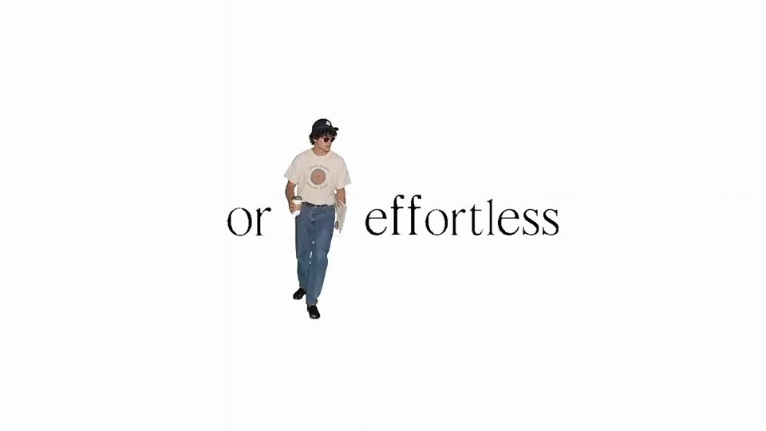
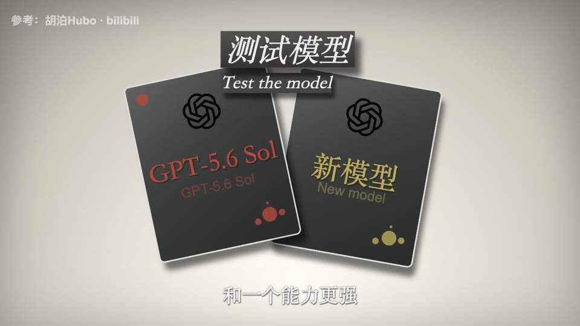
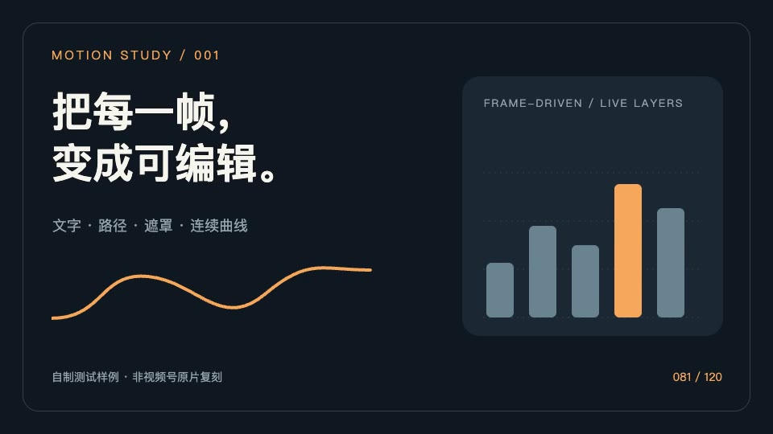

# Video / MG Replica · 视频与 MG 动画复刻



<p align="center">
  <a href="video-mg-replica/SKILL.md"></a>
  <a href="video-mg-replica/SKILL.md"></a>
  
  
  
  
</p>

<p align="center"><strong>逐帧读懂参考，分层重建画面，用代码还原运动。</strong><br />参考驱动的可编辑工程、完整成片与同步对照，一起交付。</p>

<p align="center">
  <a href="#项目能做什么">功能</a> ·
  <a href="#案例预览">案例</a> ·
  <a href="#快速开始">快速开始</a> ·
  <a href="#工作流程">工作流程</a> ·
  <a href="#常见问题">常见问题</a> ·
  <a href="CONTRIBUTING.md">参与贡献</a>
</p>

<p align="center">由 <a href="https://github.com/Ye-Zayne"><strong>Zayne / Ye-Zayne</strong></a> 与 <a href="https://github.com/jinny-wj"><strong>jinny-wj</strong></a> 共同制作与维护。</p>

## 项目能做什么

**Video / MG Replica** 是一套适用于 **Codex 与 Claude Code** 的视频复刻 Skill，随附 Python 取证工具、Remotion 工程模板和完整案例。两边使用同一套 `SKILL.md`、脚本与参考规范，按各自的技能目录安装即可。给出参考视频与复刻范围后，工作流程会围绕构图、文字、图形、镜头、动作和音轨逐项重建，输出可以继续修改的 React / SVG / Remotion 工程。

适合品牌短片、文字动效、产品演示、图表动画、知识讲解和其他参考驱动的 Motion Graphics（MG）制作。你可以严格沿用原片，也可以明确指定换文案、换配色、去人物或只处理某个时间段。

| 能力 | 具体工作 | 可检查的产物 |
|---|---|---|
| 逐帧取证 | 记录画幅、帧率、时长与来源；抽取带帧号的联系表 | `case.json`、参考片、音轨、证据帧 |
| 静态画面重建 | 对齐布局、字号、换行、锚点、颜色与遮挡关系 | 分层组件、场景静帧、元素记录 |
| 动效复刻 | 重建文字时序、路径、遮罩、镜头和跨场景接力 | 帧驱动动画、关键采样、连续运动曲线 |
| 运动拟合 | 根据实测样本拟合标量运动，用留出帧检查误差 | 曲线参数、拟合残差、验证记录 |
| 可编辑交付 | 暴露文案、图片、数字、主题色与冻结帧等参数 | Remotion 工程、替换验证图 |
| 渲染与对照 | 导出 MP4，检查切点、运动与音轨时序 | 成片、左右同步对照、差异图、QA 报告 |

这是一套由 Agent 执行的制作流程与工具集。分镜、图层和动效需要结合参考证据逐步分析与实现；脚本本身不会自动识别任意视频的全部图层。

## 案例预览

下方预览均取自仓库中的实际渲染成片，点击图片可进入相应视频文件页。

<table>
  <tr>
    <td width="33%"><a href="cases/lovart-replica/output/replica.mp4"></a></td>
    <td width="33%"><a href="cases/bilibili-ai-rebuild/revisions/motion-v2/output/动效优化版.mp4"></a></td>
    <td width="33%"><a href="examples/mg-demo/output/demo-v2.mp4"></a></td>
  </tr>
  <tr>
    <td><strong>Lovart 短片复刻</strong><br />24.83 秒 · 1280 × 720 · 24 fps<br />文字、人物媒体层、遮罩与原音轨同步。</td>
    <td><strong>长片动效修订 v2</strong><br />358.02 秒 · 56 个片段 · 10740 帧<br />卡片接力、逐字展开、图表推镜与分段叙事。</td>
    <td><strong>自制 MG 工具样例</strong><br />4 秒 · 960 × 540 · 30 fps<br />用于检查路径绘制、冻结模式、文案与主题色替换。</td>
  </tr>
</table>

| 案例 | 成片与对照 | 工程与记录 |
|---|---|---|
| Lovart 短片 | [观看成片](cases/lovart-replica/output/replica.mp4) · [原片／复刻对照](cases/lovart-replica/output/comparison.mp4) | [可编辑工程](cases/lovart-replica/project) · [验收与已知差异](cases/lovart-replica/qa.md) |
| 长片动效修订 v2 | [观看成片](cases/bilibili-ai-rebuild/revisions/motion-v2/output/动效优化版.mp4) · [动效片段对照](cases/bilibili-ai-rebuild/revisions/motion-v2/output/动效优化对照.mp4) | [可编辑工程](cases/bilibili-ai-rebuild/revisions/motion-v2/project) · [验收与已知差异](cases/bilibili-ai-rebuild/revisions/motion-v2/qa.md) |
| 自制 MG 样例 | [观看成片](examples/mg-demo/output/demo-v2.mp4) · [替换结果](examples/mg-demo/output/replacement.png) | [示例工程](examples/mg-demo) · [工具验证记录](验证记录.md) |

**案例状态说明：** Lovart 案例保留字体、纹理和部分边缘差异；长片 v2 按制作要求把人物／手部实拍改为图形讲解，包含有意改编；自制样例用于工具验证。各案例的精度与可编辑范围以对应 QA 记录为准。

## 快速开始

### 1. 下载代码

只安装 Skill 或先浏览代码时，可以跳过大素材。先安装 [Git LFS](https://git-lfs.com/)，再在 macOS / Linux 终端运行：

```bash
git lfs install
GIT_LFS_SKIP_SMUDGE=1 git clone \
  https://github.com/Ye-Zayne/video-mg-replica.git
cd video-mg-replica
```

完整项目约 **3.1 GiB**。需要参考视频、图片、音轨和成片时，在仓库根目录运行：

```bash
git lfs pull
```

也可以只下载一个案例：

```bash
git lfs pull --include="cases/lovart-replica/**"
```

<details>
<summary>Windows PowerShell 的轻量克隆方式</summary>

```powershell
git lfs install
$env:GIT_LFS_SKIP_SMUDGE = "1"
git clone https://github.com/Ye-Zayne/video-mg-replica.git
Remove-Item Env:GIT_LFS_SKIP_SMUDGE
Set-Location video-mg-replica
```

需要完整素材时同样执行 `git lfs pull`。以下依赖与工程命令适用；系统字体和 FFmpeg 安装位置需要按本机配置。

</details>

### 2. 安装 Skill

选择所用工具的安装目录与调用方式：

| 工具 | 个人安装目录 | 项目安装目录 | 显式调用 |
|---|---|---|---|
| Codex | `~/.agents/skills/video-mg-replica/` | `.agents/skills/video-mg-replica/` | `$video-mg-replica` |
| Claude Code | `~/.claude/skills/video-mg-replica/` | `.claude/skills/video-mg-replica/` | `/video-mg-replica` |

以下手动安装命令在已克隆的仓库根目录执行，适用于 macOS / Linux。安装时保留整个 `video-mg-replica/` 目录，包括 `SKILL.md`、`scripts/`、`references/`、`assets/`；`agents/openai.yaml` 是 Codex 的展示元数据，可一起保留。

**Codex** 可以直接请求：

```text
使用 $skill-installer，从下面的 GitHub 仓库安装 video-mg-replica 文件夹：
https://github.com/Ye-Zayne/video-mg-replica
```

或手动安装到个人目录：

```bash
mkdir -p ~/.agents/skills/video-mg-replica
git archive HEAD video-mg-replica | \
  tar -x --strip-components=1 -C ~/.agents/skills/video-mg-replica
```

**Claude Code** 安装到个人目录后，可在本机各个项目中使用：

```bash
mkdir -p ~/.claude/skills/video-mg-replica
git archive HEAD video-mg-replica | \
  tar -x --strip-components=1 -C ~/.claude/skills/video-mg-replica
```

若只希望在当前项目中使用，可安装到项目目录：

```bash
mkdir -p .claude/skills/video-mg-replica
git archive HEAD video-mg-replica | \
  tar -x --strip-components=1 -C .claude/skills/video-mg-replica
```

这些命令使用仓库中已提交的文件，避免复制本机 `node_modules` 和缓存。已有同名安装时请先备份本地修改。安装后若未发现 Skill，重新打开所用工具；复制安装的副本需在源版本更新后重新安装。个人目录示例面向本机使用，Claude Code 云端任务应使用提交到目标项目的 `.claude/skills/`。

路径与发现方式见 [Codex 官方 Skill 文档](https://learn.chatgpt.com/docs/build-skills) 和 [Claude Code 官方 Skill 文档](https://code.claude.com/docs/en/skills)。本项目早期本机 Codex 安装记录使用 `~/.codex/skills/`，已经被环境识别的旧安装可继续使用；避免在同一工具中重复安装同名副本。

### 3. 配置运行依赖

| 依赖 | 要求／用途 |
|---|---|
| Codex 或 Claude Code | 读取 Skill 并执行取证、实现、检查与交付流程 |
| Python | 3.10+，运行取证与运动拟合脚本 |
| Pillow | 联系表、差异图等图像处理 |
| FFmpeg + ffprobe | 探测、抽帧、音视频处理；需包含所用滤镜和编码器 |
| Node.js | 20+，运行 Remotion 工程 |
| Chrome | 渲染环境所需的浏览器 |
| npm 依赖 | 在需要运行的工程内执行 `npm ci` |

建议用虚拟环境安装 Python 依赖，然后检查取证工具：

```bash
python3 -m venv .venv
source .venv/bin/activate
python -m pip install Pillow
python video-mg-replica/scripts/video_tools.py doctor
```

Windows 激活命令为 `.venv\Scripts\Activate.ps1`。FFmpeg / ffprobe 不在 `PATH` 时，可通过 `FFMPEG`、`FFPROBE` 环境变量指定。不同机器的字体与浏览器渲染可能有差异，需复查排版。

### 4. 给出参考，开始复刻

在已发现此 Skill 的任务中，Codex 使用 `$video-mg-replica`，Claude Code 使用 `/video-mg-replica`。例如在 Codex 中输入：

```text
使用 $video-mg-replica 复刻下面这个视频。
参考视频：/绝对路径/参考视频.mp4
输出目录：/绝对路径/cases/参考01

复刻全片，保留画面比例、文案、人物、音乐和动效节奏。
文字、图形、数字与 MG 动画需要可编辑。
请交付完整 MP4、可编辑工程、同步对照和已知差异说明。
```

在 Claude Code 中，把上述提示词的第一行改为：

```text
/video-mg-replica 复刻下面这个视频。
```

其余参考路径、输出目录与交付要求相同。

按需要追加约束：

| 需求 | 可以补充的指令 |
|---|---|
| 只复刻一段 | `时间范围：2.5–12.5 秒。` |
| 先审静帧 | `本轮先做各场静帧，等我确认后再做动效。` |
| 换成自己的内容 | `允许替换文案、图片和配色，保留动效结构。` |
| 去掉人物 | `把人物段改成图形讲解，并标出改编部分。` |
| 提高特定片段精度 | `重点修正 8–12 秒的遮罩、文字时序和镜头运动。` |

## 先运行一个示例

在仓库根目录执行：

```bash
cd examples/mg-demo
npm ci
npm run studio
```

Studio 打开后可浏览时间轴和修改参数。导出视频或静帧：

```bash
npm run render -- demo.mp4
npm run still -- preview.png --frame=90
npm run typecheck
```

长片 v2 的最终导出需要保留原音轨封装，请使用该工程的 [`render:final` 命令](cases/bilibili-ai-rebuild/revisions/motion-v2/project/README.md)。不同案例的参数与导出方式以各自工程 README 为准。

## 工作流程

**参考视频 → 逐帧取证 → 静态布局 → 动作重建 → 渲染对照 → 定向修正 → 完整交付**

1. **先读证据。** 核对源视频和范围，生成联系表、来源记录与场景分析；动作密集处补充逐帧采样。
2. **先做一个代表性动作片段。** 匹配落定画面，再实现文字、路径、遮罩和镜头；验证可实现后提炼组件，扩展到全片。
3. **保证可编辑与可复现。** 动画由帧号驱动；暴露合适的文案和素材参数；实际渲染替换用例与冻结帧。
4. **对照后交付。** 抽查首尾、切点、动作中段与音轨时序；分别记录技术、静态、运动、音频和可编辑性。默认初版后最多两轮定向修正，需要时可继续迭代。

一个完整案例通常包含：

```text
cases/your-case/
├── case.json           # 元信息、来源与归一化记录
├── analysis.md         # 场景、元素、运动与判断依据
├── source/             # 参考片与音轨
├── evidence/           # 帧号联系表与关键证据
├── project/            # 可编辑 Remotion 工程
├── output/             # MP4 与交付文件
├── qa/                 # 同步对照、差异图、检查数据
└── qa.md               # 验收结果、编辑边界与保留差异
```

## 工具与目录

| 路径 | 内容 |
|---|---|
| [`video-mg-replica/SKILL.md`](video-mg-replica/SKILL.md) | 完整制作流程与交付标准 |
| [`scripts/video_tools.py`](video-mg-replica/scripts/video_tools.py) | 环境检查、归一化、抽帧、联系表、差异与对照视频 |
| [`scripts/fit_motion.py`](video-mg-replica/scripts/fit_motion.py) | 根据实测样本拟合连续运动曲线 |
| [`references/`](video-mg-replica/references) | 取证、MG 运动、动作配方、Remotion 与验收规范 |
| [`assets/remotion/`](video-mg-replica/assets/remotion) | 默认空画面的 Remotion 起始工程 |
| [`examples/`](examples) | 自制样例与工具验证素材 |
| [`cases/`](cases) | 参考素材、案例工程、修订版本、成片及 QA |
| [`tests/`](tests) | 取证与拟合工具的自动化测试 |

<details>
<summary>命令行工具示例</summary>

在仓库根目录运行。`inspect` 的输出应是一个尚未存在的新案例目录：

```bash
python video-mg-replica/scripts/video_tools.py inspect \
  /absolute/reference.mp4 --out /absolute/cases/reference-01

python video-mg-replica/scripts/video_tools.py frames \
  /absolute/cases/reference-01/source/reference.mkv \
  --out /absolute/cases/reference-01/evidence/overview --step 15

python video-mg-replica/scripts/video_tools.py compare \
  /absolute/cases/reference-01/source/reference.mkv \
  /absolute/cases/reference-01/output/replica.mp4 \
  --out /absolute/cases/reference-01/qa/round-01 --step 10 --video
```

更多参数可用 `--help` 查看。拟合输入格式见 [运动配方说明](video-mg-replica/references/motion-recipes.md)。

</details>

## 验证与边界

现有仓库包含真实渲染和检查记录：自制样例验证了冻结模式、替换参数及取证工具；Lovart 案例记录了完整导出和音轨偏移修正；长片 v2 记录了 56 个片段的时间线覆盖、参数替换和曲线图镜头拟合。

以下结论仍需要逐案例确认：

- **“渲染成功”与“视觉一致”分别验收。** 差异指标不直接等于相似度百分比，也不能替代正常速度回放。
- **可编辑范围取决于实现。** 普通文字和参数可直接替换；特殊字形、复杂插画或逐帧媒体层可能需要编辑路径与素材。
- **原素材越完整，越有利于复刻。** 字体、原始图片、分层工程和独立音轨缺失时，部分细节只能近似重建。
- **复杂 3D、摄影材质、粒子、景深等需要额外实现。** 当前项目不保证所有视频都能自动逐帧还原。

[工具验证记录](验证记录.md)保留早期检查时点；后续案例请以各自 `qa.md` 的结果与范围为准。

## 常见问题

**只给一个链接就能开始吗？**

可访问的链接可以作为入口，实际仍需要读取视频内容。微信视频号、登录限制或已失效链接无法读取时，请提供 MP4 / MOV 或清晰录屏。

**需要下载 3.1 GiB 才能安装 Skill 吗？**

不需要。可使用轻量克隆，只安装 `video-mg-replica/`。运行某个现有案例时，再用 Git LFS 下载对应素材。

**为什么下载的 MP4 只有几行文本？**

那是 Git LFS 指针。安装 Git LFS 后，在仓库中执行 `git lfs pull` 获取实际媒体文件。

**输出的是 After Effects 工程吗？**

输出为 React / SVG / Remotion 代码工程和视频文件，不包含 `.aep`。

**是否需要额外的付费生成服务？**

Skill 随附的取证、拟合和渲染工具不依赖付费生成服务；执行任务所用的 Codex / Claude Code 帐号与模型服务按你的环境配置。

**换一台电脑后画面不同怎么办？**

先核对字体、Node.js、锁定的 npm 依赖、浏览器和 FFmpeg，再用落定帧与同步对照定位差异。

## 共同作者与参与贡献

本项目由 **[Zayne / Ye-Zayne](https://github.com/Ye-Zayne)** 与 **[jinny-wj](https://github.com/jinny-wj)** 共同制作与维护。

欢迎通过 [Issues](https://github.com/Ye-Zayne/video-mg-replica/issues) 提交可复现的问题或改进建议，通过 Pull Request 改进工具、文档和案例。请阅读 [贡献指南](CONTRIBUTING.md)，说明修改范围、验证方式及已知差异。安全相关问题请参阅 [安全说明](SECURITY.md)。

参考视频、音轨、字体和第三方图形的来源及使用说明见各案例记录；仓库公开不等于其中所有素材均获得再分发或商用授权。
